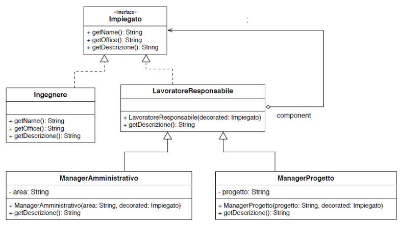

# Formulario di IS

## Tipi

Esistono due tipi su java, tipi primitivi, passati per copia, tipi object passati per riferimento!

> boolean
> char
> short
> int/Integer
> long
> float
> double/Double
> String

Per i tipi primitivi che hanno il corrispettivo Obj il boxing (`Integer i=5;`) e l'unboxing (`int id=i;`) è eseguito in automatico.

##### String

| Metodo                  | Descrizione                                                                                                  | Return Type |
| ----------------------- | ------------------------------------------------------------------------------------------------------------ | ----------- |
| s.charAt(integer)       | Return char at index                                                                                         | char        |
| s1.compareTo(s2)        | return: <ul><li>Valori negativi se s1< s2 </li><li>Valori positivi se s1> s2 </li><li>0 se s1==s2 </li></ul> | Int         |
| s1.equals(s2)           | Check if 2 string are equals                                                                                 | boolean     |
| s1.equalsIgnoreCase(s2) | Check if 2 string are equals, case ignored                                                                   | boolean     |
| s1.length()             | Return the length                                                                                            | int         |

##### StringBuffer

```Java
  StringBuffer s2=new StringBuffer();
  s2.append("A"); //Più veloce di String s; s+="a";
  //String immutable e viene ogni volta reistanziata implicitamente
```

## I/O

Gestiti da `System.in`

Lista metodi:

```Java
Scanner in=new Scanner(System.in);
```

```Java
in.nextLine(); //Legge la prossima riga

in.next(); //Legge la stringa fino ad uno spazio

in.nextInt(); //Legge il prossimo int

in.nextDoble(); //Legge il prossimo double

in.hasNext(); //C'è una stringa da leggere

in.hasNextInt(); //etc...
```

## Array e generics

```Java
int[] a={1,2,3}; //Array: [1,2,3]
int[][] matrix={{1,2,3},{4,5,6}}; //Matrix
int[] array=new int[10]; //Array tutto a 0 -> Ogni tipo ha un valore di default (int=0)
NomeClasse[] nomeArray=new NomeClasse[10]; //Sono tutti puntatori a NULL!

//Per accedere alla lunghezza
int l=a.length;
```

### Java Generics Class

I generics in java sono implementati da `java.util.*` e sono di vario tipo:

```Java
public ArrayList<FooClass> list=new ArrayList<FooClass>();
list.add(new FooClass());//Add to the end of the list
list.get(0); //Return the first element index
list.set(0,new FooClass());//Set the 0 element
list.remove(0)//Remove and return the element with 0 index

//Per accedere alla lunghezza si usa .size()
int l=list.size();
```

### Cast generics

Sia Figlio sottoclasse di Padre=> Generics\<Figlio\> non è sottoclasse di Generics\<Padre\>

### Generics Class declared by User

```Java
public class NomeClasse<T>{//T non può essere tipo primitivo!
  private T variable;

  public T foo(){} //It returns T

  public <K,V> T foo2(K var1,V var2){ //It takes 2 elements of type K and V and return T elements
    return new T();
  }
}
```

## Visibilità

| Tipo                      | Visibilità                                           | Usabile            |
| ------------------------- | ---------------------------------------------------- | ------------------ |
| public                    | Visibile a tutti, sia nel package che fuori          | Classi e attributi |
| private                   | Visibile solo all'interno della classe               | Solo attributi     |
| protected                 | Visibile all'interno del package e dalle sottoclassi | Solo attributi     |
| package-private (default) | Visibile solo all'interno del package                | Classi e attributi |

## Classi

```Java
public class NomeClasse{
    //Il costruttore di default viene rimosso se si dichiara un costruttore custom
    //Può essere private-> Non istanziabile
    public NomeClasse(int attr){
    }

    public NomeClasse(){
        this(10); //Richiama il costruttore custom ->Riusabilità codice
    }

    public void NomeMetodo(params){}

    public NomeClasse foo(){
      return this; //Return the reference to the instance
    }
}
```

### Ereditarietà

**Attenzione**
Nel casi si volesse estendere una classe e implementare una interfaccia, è necessario seguire l'ordine

```Java
public class CF extends CP implements I1,I2,I3{

}
```

```Java
public class Padre{}
public class Figlio extends Padre{} //L'estensione può avvenire solo per un tipo di classe
//e non è possibili estendere più classi contemporaneamente
```

**Se la classe padre (o superclasse) ridefinisce il costruttore e non implementa quello di default `NomeClasse()` allora è necessario richiamarlo esplicitamente dalla sottoclasse, altrimenti, il costruttore di default (super()) è chiamato implicitamente da ogni costruttore della sottoclasse**

```Java
public class Padre{
  private final int age; //Deve essere assegnato un valore nel momento della dichiarazione o nel
  //costruttore
  public Padre(int age){
    this.age=age;
  }
  public void foo(){}
}

public class Figlio extends Padre{
  public Figlio(int age){
    super(age);
  }

  @override
  public void foo(){ //La visibilità non può essere più restrittiva del metodo su cui
    //si fa override
    super.foo() //Richiama il metodo base
  }
}
```

### Polimorfismo

In Java si distingue tra **tipo statico** e **tipo dinamico**

```Java
Padre p=new Figlio(); //Tipo statico Padre, tipo dinamico Figlio
```

I metodi che possono essere chiamati sono quelli contenuti nel tipo statico _Padre_, ma, l'implementazione chiamata è quella di _Figlio_

```Java
Figlio f=new Padre(); //Errore-> Non può essere che una sottoclasse contenga una superclasse
Padre p=new Figlio(); //Corretto
```

#### Instanceof

L'operatore instanceof permette di capire se il tipo dinamico di un oggetto è un determinato tipo

```Java
Object a=new String();
(a instanceof String) //True
(a instanceof Double) //False
```

#### Equals

Metodo definito da obj da ridefinire

```Java
public class FooClass{
  private int variable;
  public boolean equals(Object a){
    if(!(a instanceof FooClass)) return false;

    return this.variable=((FooClass)a).variable;
  }
}
```

#### To String

```Java
public class FooClass{
  private int variable;
  public toString toString(){
    return String.format("The number is: "+variable);
  }
}
```

### Classi Abstract

Le classi abstract permettono di definire solo parte dell'implementazione

```Java
public abstract class Shape{
  //ASSOLUTAMENTE NO PRIVATE
  public abstract void foo(); //Dichiarata, ma non implementata
  public int fun(){ //Definita
    return 0;
  }
}

public class Circle extends Shape{
  @override
  public void foo(){ //Must be implemented
    //...
  }
}
```

Le classi abstract possono fare da tipo statico ma non è permesso eseguire l'operazione di `new Shape()`

```Java
Shape s1=new Circle(); //Coretto
Shape s2=new Shape(); //ERRATO
```

### Interface

Le interface permettono di definire tutti i metodi pubblici che una classe deve **per forza** implementare, può contenere anche variabili final o STATIC<br>
Si possono implementare più interface `implements IShape,IShape2`

```Java
public interface IShape{
  int perimeter(){} //DEVE CONTENERE ANCHE EVENTUALI THROWS
}
public class Shape implements IShape{
  public int perimeter(){
    return 0;
  }
}
```

### Classi Nested e anonime

Le classi nested possono essere private, public, protected o package-private

> Le classi non statiche (inner class) ha accesso a tutti gli elementi
>
> Le classi statiche (static nested class) non hanno accesso a nulla se non tramite i normali metodi, sono nested solo per convenienza

#### Inner Class e Static Nested Class

```Java
public class ClasseEsterna{
  private final variable=0;

  public class ClasseInterna{//Ha accesso a tutte le variabili
    public int foo(){
      return variable;
    }
  }

  public static class ClasseStatica{ //Non ha accesso a nulla, qui per convenienza
  }
}

public class ClassMain{
  public static void main(String[] args){
    ClasseEsterna ce=new ClasseEsterna();
    ClasseInterna ci=ce.new ClasseInterna(); //Istanza di ClasseInterna su ce
    System.out.println(ci.foo());
  }
}
```

#### Classi anonime

```Java
Thread myTask1=new Thread(
  new Runnable(){ //Istanza di una interface o classe abstract direttamente
    @override
    public void run(){

    }
  });
```

## Eccezioni

Esistono due tipi di eccezioni, checked e unchecked

#### Checked

Le eccezioni checked derivano da Exception

```Java
public class CustomException1 extends Exception{ //Checked Exception
  public CustomException(){super();}
  public CustomException(string s){super(s);}
}
public class CustomException2 extends Exception{ //Checked Exception
  public CustomException(){super();}
  public CustomException(string s){super(s);}
}


public class CustomRuntimeException extends RuntimeException{
  public CustomRuntimeException(){super();}
  public CustomRuntimeException(string s){super(s);}
} //Unchecked Exception

public class FooClass{
  void foo() throws CustomException1,CustomException2{ //Poichè l'eccezione è checked va nella firma del metodo
    throw new CustomException(); //Permette di inalzare un'eccezione
  }
  void fooUnchecked(){
    throw new CustomRuntimeException();
  }
}

public class MainClass{
  public static void main(String[] args){
    FooClass fc=new FooClass();

    try{
      fc.foo();
    }
    //Poichè l'eccezione è checked, la chiamata nel metodo va in Try/Catch o la firma
    //deve a sua volta contenere il throws CustomException
    catch(CustomException e){ //Posso gestire più eccezioni (in ordine di specificità)
    }
    catch(Exception e){
    }
    //Il blocco è sempre eseguito, sia che l'eccezione sia gestita o no.
    finally{
    }

    fc.fooUnchecked();//Non bisogna inserire la chiamata in un try
  }
}
```

## Iteratori e Iterable

### Iteratori

L'interfaccia Iterator\<T\> permette di definire vari metodi:

```Java
boolean hasNext(); //Returns true if there are more elemets.
E next(); //Returns the next elements
void remove();//Remove the last elements returned by the iterator-> Può essere chiamato una volta
//per ciascun next() ->Default solleva eccezione
```

#### Iteratori Stand Alone

```Java
public class Fibonacci implements Iterator<Integer>{
  public int prev1,prev2;
  public Fibonacci(){
    this.prev1=0;
    this.prev2=0;
  }
  public boolean hasNext(){
    return true;
    }
    public Integer next(){
      if(prev2=0){
        prev2=1;
        return 0;
      }
      int nextFib=prev1+prev2;
      prev1=prev2;
      prev2=tmp;
      return nextFib;
    }
}
```

### Iterable

L'interfaccia Iterable\<T\> richiede l'implementazione di un solo metodo

```Java
public class GenericsClass<T> implements Iterable<T>{
  public Iterator<T> iterator(){
    return this.new CustomIterator();
  }
  private class CustomIterator implemets Iterator<T>{ //Inner class

        @Override
        public boolean hasNext() {
            return //cond;
        }

        @Override
        public T next() {
            return //somethings;
        }
  }
}

public class MainClass{
  public static void main(String[] args){
    GenericsClass<Integer> gc=new GenericsClass<Integer>();

    //->Iterable permette di avere tramite l'iterator permette di usare il for compresso
    for(Integer g:gc){
      System.out.println(g);
    }

    Iterator<Integer> iter=gc.iterator();
    while(iter.hasNext()){
        System.out.println(iter.next());
    }
  }
}
```

## Programmazione funzionale

Stile di programmazione che incoraggia la computazione come l'applicazione di **funzioni sui dati**

- No Side Effect
- Valore funzione dipende solo dagli input
- Oggetti Immutable

Espressioni (Interface):

- Function<T,R> Prende T e restituisce R //apply
- BiFunction<T,U,R> Prende T e U e restituisce R //apply
- Consumer\<T> Prende T e restituisce void //accept
- Predicate\<T> Prende T e restitusce un booelan //test
- Supplier\<T> Rappresenta fornitore di risultati
- Collector\<T,A,R> T:Input, A:Mutable Accumulator, R:Result

##### Collector

Collector richiede l'implementazione di vari metodi

```Java
public interface Collector<T, A, R> {
    Supplier<A> supplier();
    BiConsumer<A, T> accumulator();
    Function<A, R> finisher();
    BinaryOperator<A> combiner();
    Set<Characteristics> characteristics();
}
```

#### Example:

```Java
public class Pow implements Function<Integer,Integer>{
   public Integer apply(Integer ngr){return nbr*nbr}
}

public class MainClass{
  public static void main(String[] args){
    Pow p=new Pow();
    System.out.println(p.apply(2));

    Function<Integer,Integer> po=x->x*x; //Classe anonima
    System.out.println(po.apply(2));
  }
}
```

#### Sintax:

```Java
()->...
(x)-> x*x;
(x)-> {return x;}
(int x)->x*x;

//Short
pl.forEach(Person::printName); //Per ogni persona in pl chiama il metodo printName
```

## Stream

Sequenza infita di oggetti.
Fornisce diversi metodi che possono essere messi in cascata per ottenere il risultato voluto.

- **NON** fornisce un modo per accedere e manipolare direttamente i dati
- No memorizzazione -> Non cambia la lista di partenza
- Funzionali per natura: Non modificano i dati
- Sono infiniti

Metodi intermedi (restituisce uno stream):

- filter(Predicate\<T> T)
- sorted(Comparator\<T>)
- map(Function\<T,R>)
  Metodi terminali:

- collect(Collectors): Si usano Collectors.toList, Collectors.toSet...
- forEach(Consumer\<T>)
- reduce(BiFunction\<A,T,R>) //A:Accumulator, T:Value, R:Return

#### Example:

```Java
public class MainClass{
  public static void main(String[] args){
    List<String> ls=Arrays.asList("Brian","Nate","Neal","Sara");

    ls.stream().filter(x->x.length()>=4).forEach(x->System.out.println(x));
    //>>> Nate,Neal,Sara

    ls.stream().map(x->x+"1").collect(Collections.toList());

    System.out.println(ls.stream().reduce("",(acc,el)->acc+="_"+el));
    //>>>Brian_Nate_Neal_Sara
  }
}
```

## Optional

```Java
Optional<Integer> number=foo();
number.ifPresent(a->print(a));
number.get(); //Throw NoSuchElementException if number=null
number.orElse(10); //Return number if present, otherwise the element in parentesis
number.orElseGet(method()); //Return number if present, otherwise invoke method
//and return that invocation
number.filter(n->n>10); //return number if true otherwise return empty optional.
```

## Thread

#### Extends Thread

```Java
public class MyThread extends Thread{
  @override
  public void run(){
    //stuff
  }
}
public class ProvaThread {
  public static void main(String[] args) {
    MyThread t1;
    t1 = new MyThread();
    t1.start();
}
}
```

Methods on thread:

```Java
Thread t=new Thread();
t.start();//Lo avvia
t.join(); //Aspetta la fine del Thread
t.isAlive(); //Controlla se thread vivo
t.sleep(ms); //Ne sospende l'esecuzione per tot ms
t.yield(); //Mette temporaneamente in pausa il thread e consente l'esecuzione di altri thread
```

#### Implements Runnable

```Java
public class MyTask implements Runnable{
  @override
  public void run(){
    //stuff
  }
}
public class ProvaThread {
  public static void main(String[] args) {
    Thread t1,t2;
    t1 = new Thread(new MyTask());

    t2 = new Thread(new Runnable(){
      public void run(){}
    })
}
```

### Condivisione Dati tra Thread

#### Synchronized

Java associa un lock all'oggetto e ogni volta che si chiama un metodo synchronized il thread acquisisce il lock se è libero o rimane in attesa aspettando che qualcun altro liberi il lock.
Oss: Se un metodo synchronized invoca un altro metodo synchronized non bisogna riacquisire il lock, poichè è già acquisito.

```Java
public class Counter{
  private final qualcosa=0;//Può essere letto senza metodo synchronized poichè costante
  private int count=0;
  public Counter(){ //MAI SYNCHRONIZED
    count=0;
  }
  public synchronized void add(int i){
    count+=i;
  }
  //Synchronized perchè quando leggo un valore voglio essere sicuro che non mi trovi
  //in uno stato intermedio
  public synchronized int get(){
    return count;
  }
}
```

Oss:
You can’t synchronize abstract methods in Java

#### Synchronized on Static method

Esiste un lock speciale dedicato alla classe non interferisce con quello relativo alle istanze

#### Synchronized Statements

Permette di fare un'operazione di sync su solo una porzione di codice

```Java
public void foo(){
  synchronized(this){

  }

  synchronized(obj){

  }
}
```

#### Problemi lock

| Tipo       | Descrizione                                                                                                            |
| ---------- | ---------------------------------------------------------------------------------------------------------------------- |
| Starvation | Il thread rimane in attesa di una risorsa per un tempo infinito                                                        |
| DeadLock   | Due o + thread sono in condizione tale che nessuno può evolvere perchè necessitano di risorse che ha acquisito l'altro |
| Liveness   | Un'operazione viene eseguita in tempi accetabili                                                                       |
| Livelock   | Ciclo di operazioni infinite inutili ai fini della computazione                                                        |

#### Wait, notify and notifyAll

Vanno eseguiti all'interno di synchronized!

- wait() -> Mette in attesa il thread
  - Richiede di essere all'interno di un try catch **throws InterruptedException**
  - Ha una variante wait(long timeout) dove scaduto timeout il thread riparte
- notify() -> Sveglia un thread in attesa
- notifyAll() -> Sveglia tutti i thread in attesa

```Java
public class Fifo{
  private static MAX_SIZE=10;
  private LinkedList<Integer> ls;
  private int count;
  public Fifo(){
    ls=new LinkedList<>();
    count=0;
  }

  public synchronized void queue(Integer num){
    while(count==MAX_SIZE){
      wait();
    }
    count++;
    ls.addLast(num);
  }

  public synchronized void dequeue(){
    while(count==0){
      wait();
    }
    count--;
    notifyAll();
    return ls.removeFirst();
  }
}
```

Ulteriore esempio

```Java
Valve valve = new Valve();
Thread threadValve = new Thread(valve);
threadValve.start();

synchronized (valve){ //Faccio il lock sul singolo oggetto
  try {
    valve.wait(5000);//Wait su valve.
  } catch (InterruptedException e) {
    e.printStackTrace();
  }
}
```

#### ReentrantLock

Offre 3 metodi:

- lokc() -> Acquisce il lock
- tryLock() -> Acquisce il lock se non in possesso da altri thread
- unlock() -> Rilascia lock

```Java
public class FooClass{
  private final Lock lock = new ReentrantLock();

  public void foo(){
    try{
      myLock=lock.tryLock();
    }
    finally{
      //Nel finally perchè va sempre eseguito l'unlock
      if(myLock) lock.unlock();
    }
  }
}
```

#### Esecutori

Implementano l'interfaccia ExecutorService

```Java
ExecutorService esecutore=Executors.newFixedThreadPool(2);
esecutore.submit(new Runnable(){...})
```

Offrono vari metodi:

- newSingleThreadExecutor();
- newCachedThreadPool();
  ...

#### Oggetti Thread-Safe

Oggetto che offre da contratto operazioni atomiche

AtomicBoolean, AtomicInteger,AtomicIntegerArray,AtomiIntegerFieldUpdater,AtomicLong

## Socket

##### Server

```Java
public class ServerClass{
  public static int PORT=8000;
  ServerSocket ss;
  public ServerClass(){

  }

  public void start() throws IOException{
    ss=new ServerSocket(PORT); //IOException
    while(true){
      Socket client=ss.accept();
      Scanner in=new Scanner(sc.getInputStream());
      PrintWriter out=new PrintWriter(sc.getOuputStream());
      String name=in.nextLine();
      out.println("Benvenuto "+in);
      out.flush();
    }
  }
  public void close(){
    try{
      ss.close()
    }
    catch (IOException e){

    }
  }
}
```

##### Client

```Java
public class ClientClass{
  Socket socket;
  public ClientClass(String host,int port){
  }
  public void start() throws IOException{
    socket=new Socket(host,port); //Exception
    Scanner in=new Scanner(sc.getInputStream());
    PrintWriter out=new PrintWriter(sc.getOuputStream());
    out.println("Marco");
    out.flush();
    String welcomeMessage=in.nextLine();
    System.out.println(welcomeMessage);
  }
  public void close(){
    try{
      socket.close();
    }
    catch(IOException e){

    }
  }
}
```

### Serializzazione

Serializzazione: Consiste nel trasformare un oggetto in uno stream di byte
De-serializzazione: Processo inverso

Solo le istanze delle classi possono essere serializzate e i tipi primitivi **non** possono essere serializzati.

Un oggetto per essere deve implementare l'interfaccia `Serializable` che è **vuota**
Per serializzare un oggetto basta scriverlo dentro un ObjectOutputStream o ObjectInputStream

In un oggetto Serializable vengono serializzati:

- Tipi primitivi
- Oggetti non static
- Per ogni attributo (di tipo non primitivo) viene applicato ricorsivamente la serializzazione (e deve quindi essere a sua volta Serializable o deve avere la parola chiave `transient` che fa saltare la serializzazione

Oss: Se due oggetti contengono lo stesso riferimento a vengono serializzati nello stesso stream, allora l'oggetto in comune manterrà il riferimento condivisio
Non avviene se serializzati in due stream diverse

```Java
//Chi legge
  inputStream = new ObjectInputStream(socket.getInputStream());
  Object o = inputStream.readObject();
//Chi scrive
  ObjectOutputStream outStream = new ObjectOutputStream(socketToServer.getOutputStream());
  outStream.writeObject("test message #"+i);
```

## RMI

RMI agisce come middleware e permette, tramite una semplice chiamata a metodo di interagire con oggetti remoti come se fossero nella stessa JVM.

### Oggetti RMI

- Oggetto remoto: Oggetto su cui eseguire le chiamate a metodo
- Interfaccia remota: Dichiara quali metodi sono chiamabili da una diversa JVM
- Server: Insieme di uno o più oggetti che implementando le interfacce remote offrono risorse
- Remote Method Invocation: Invocazione metodo remoto

### Come funziona

Il client colloquia con un proxy locale del server detto **stub** che si preoccupa di forwardare le richieste.

#### RMI Registry

Si occupa di fornire al client lo stub richiesto.

#### Implementazione classe remota

##### Interfaccia remota

Le interfacce di oggetti condivisi devono estendere **Remote**

```Java
public interface PriceI extends Remote{
  public int getPrice(int qty);
}
```

##### Classe remota

La classe deve implementare l'interfaccia condivisa e estendere UnicastRemoteObject che rende accessibile da remoto l'oggetto
->Attenzione: **È obbligatorio gestire le eccezioni che possono essere causate da una chiamata ad oggetto remoto dal client**

```Java
public class Price extends UnicastRemoteObject implements PriceI{
  public int getPrice(int qty){ return qty*10;}
}
```

#### Pubblicazione oggetto remoto

Il registro RMI deve sempre essere online prima della pubblicazione dell'oggetto (di default localhost alla porta 1099)

```Java
import java.rmi.registry.LocateRegistry;
import java.net.MalformedURLException;
import java.rmi.Naming;
import java.rmi.RemoteException;
public class Main{
  public static void main(String[] args) throws RemoteException,MalformedURLException{
    Price priceInstance=new Price();
    //Create registry on local host
    LocateRegistry.createRegistry(1099);//Port as argument throw RemoteException
     //The first argument must be //host:port/name (default port is 1099)
    Naming.rebind("rmi://127.0.0.1/chat",priceInstance);//throw MalformedURLException

    //Now the class is accessable in remote
  }
}
```

Metodo alternativo

```Java
Registry registry= LocateRegistry.getRegistry();
registry.bind("priceInstance", priceInstance);
```

#### Accesso all'oggetto remoto

L'accesso avviene solo tramite interface poichè il client **NON** conosce l'implementazionev vera e propria remota

```Java
public class MainClient{
  public static void main(String[] args) throws NotBoundException,MalformedURLException,RemoteException{
    //Return a reference (stub) for remote object as remote interface
    PriceI priceInstance=(PriceI) Naming.lookup("rmi://127.0.0.1/chat");

    System.out.println(priceInstance.getPrice(10)); //>> 100
  }
}
```

Metodo alternativo con registry in locale

```Java
Registry registry= LocateRegistry.getRegistry();
PriceI centralWarehouse = (PriceI) registry.lookup("priceInstance");
```

###### Naming.rebind

```Java
public static void rebind(String name,
          Remote obj)
                   throws RemoteException,
                          MalformedURLException
```

###### Naming.lookup

```Java
public static Remote lookup(String name)
                     throws NotBoundException,
                            MalformedURLException,
                            RemoteException
```

## UML

3 tipi:

- **Diagrammi di struttura**: Diagramma classi, oggetti o altro
- **Diagrammi di comportamento**:Casi d'uso
- **Diagrammi di interazione**: Diagrammi di sequenza

### UML Classi

### Rappresentazione classe

 <br>

- Nome classe: <span style="color:blue">Text</span> (In corsivo se la classe è abstract)
- Attributo: <span style="color:blue">visibilità nome [molteplicità]: tipo =valore default {stringa di proprietà}<span style="color:blue">
- Metodo: <span style="color:blue">visibilità nome (parametri): tipo ritorno {stringa di proprietà}</span>

**<span style="color:red">Oss: Se una variabile o un metodo è sottolineato => è statico</span>**

##### Visibilità

| Simbolo | Visibilità      |
| :-----: | --------------- |
|  **+**  | public          |
|  **-**  | private         |
|  **#**  | protected       |
|  **~**  | package-private |

### Associazioni

- Indicano relazioni tra classi
  Può avere:
  - Nome
  - Ruoli svolti dalle classi nell'associazione
  - Cardinalità (1 ; 0..1 ; 1..\* ; n, n..m -> es: 4..6) (Va vicino alla relazione di arrivo)

Una relazione indica che la classe contiene un attributo pari alla classe con la relazione, anche se non descritta esplicitamente


### Aggregazioni

Classe particolare di associazione (oggetto è part-of) (rombo vuoto)
**In Java sono equivalenti alle associazioni.**


### Composizione

Le parti non esistono senza il contenitore, se questo viene distrutto, allora si perdono i riferimenti alle parti
**In Java sono equivalenti alle associazioni.**


### Ereditarietà

Le classi possono ereditare da altre classi tramite una freccia verso la superclasse con triangolo pieno


### Interfacce

Rappresentazione di una interfaccia (i metodi sono pubblici)


##### Implementazione interfacce (Offerta-Provided)

L'implementazione è uguale alle classi, ma tratteggiate


##### Uso di oggetti che implementano l'interfaccia (Richiesta-Required)

L'uso di una interfaccia è espresso tramite una freccia tratteggiata


### Diagrammi di interazione

Descrizione del comportamento dinamico di un gruppo di oggetti che interagiscono tra di loro
Si rappresentano:

- Entità
- Messagi scambiati
  


## Principi di progettazione

Sinotmi di un progetto mal fatto:

- Rigido (ai cambiamenti)
- Fragile (molti bug)
- Immobilità (incapacità di riuso)
- Viscoso (tendenza ad utilizzare "hack" di programmazione)

### SOLID

##### Single Responsibility

NON deve mai esistere più di una ragione per cui una classe debba mutare

##### Open/Closed

Il codice deve essere aperto alle estensioni tramite i principi di overriding e ereditarietà <br>
Il codice deve essere chiuso alle modifiche, ovvero, il cambiamento di parametri e/o costanti non implica che vada cambiato il codice che opera con quelle costanti<br>
Es:

```Java
//Non rispetta il principio di open/closed
public foo(){
  System.out.println("Testo");
}

//Rispetta il principio
public foo(String text){
  System.out.println(text);
}
```

##### Liskov Substitution Principle

Tutti i moduli che utilizzano una classe devono poter funzionare correttamente se viene passata una sottoclasse a questi moduli.
=> Il comportamento della sottoclasse deve essere compatibile con la specifica della superclasse

##### Interface Segregation

Ogni interfaccia deve integrare solo i metodi necessari.
I client **NON** devono essere costretti ad implementare metodi che non usano=> Suddivisione interfacce grosse e ereditarietà multipla

##### Dependency Inversion

I moduli di alto livello non dovrebbero dipendere dai moduli di basso livello.
**Entrambi dovrebbero dipendere dalle astrazioni**

Con alto livello si intende la logica di business, con basso livello i dettagli implementativi

Es: La logica non deve dipendere da SQLDB, ma da DBInterface e SQLDB deve implementare DBInterface

##### Anti pattern

Violazione dei principi di programmazione
-> Bisogna sfruttare al massimo il polimorfismo.

## Pattern

- Schemi di soluzioni riutilizzabili -> Permettono di non riinvetare la ruota.
- Potrebbero creare un overhead eccessivo su un progetto

Tipologie:

- Creazionali: Meccanismi di creazione
- Strutturali: Gestiscono la separazione tra interfaccia e implementazione e modalità di composizione tra oggetti per creare strutture dati complesse
- Comportamentali: Modificare comportamento oggetti minimizzando la quantità di codice

### Factory Method

Una classe non può anticipare il tipo di oggetti che deve creare.

###### Soluzione 1 (Migliore)

Le sottoclassi definiscono l’implementazione
=>Si usa un metodo abstract protected che sarà implementato sulla **sottoclasse**


```Java
public abstract class PetSchool{
  List<Pet> animals=new ArrayList<Pet>();
  public PetSchool(){
    for(int i=0;i<50;i++){
      animals.add(this.createObject());
    }
  }

  //Il metodo createAnimal si preoccupa di essere il factory method che istanzia in modo corretto animals in base al valore dinamico della classe.
  protected abstract Pet createAnimal();
}
public class DogSchool extends PetSchool{

  @override
  public Pet createAnimal(){
    return new Dog();
  }
}
```

###### Soluzione 2 (Peggiore)

Il metodo factory può creare oggetti di tipo diverso in base al valore di uno o più parametri (associazione inutile)


```Java
public class ShapeFactory {
  public static Shape getShape(String shapeType){
    if(shapeType == null) return null;
    if(shapeType.equalsIgnoreCase("CIRCLE")) return new Circle();
    if(shapeType.equalsIgnoreCase("RECTANGLE")) return new Rectangle();
    if(shapeType.equalsIgnoreCase("SQUARE")) return new Square();
    return null;
  }
}
```

## Abstract Factory

Il pattern AF permette di definire una interfaccia Factory che garantisce che sia possibile generare classi di tipoligia diverse in base al tipo dinamico.
Il client avrà una AF, passata come parametro e non dipenderà quindi dall'implementazione.


In base all'interface "FornitureFactory" noi abbiamo definito una interfaccia di factory in grado di tornare diverse tipologie di oggetti in base al tipo dinamico delle factory.
E' possibile ampliare questo creando anche un produttore di factory (facoltativo)

## Singleton

Garantisce che di una classe ne esista solo e soltanto un esemplare
Versione 1:

```Java
public class Singleton{
  private static Singleton instance=new Singleton();
  public static Singleton getInstance(){
    return instance;
  }
  //Il costruttore va sempre private
  private Singleton(){

  }
}
```

Versione 2: Lazy

```Java
public class Singleton{
  private static Singleton instance;

  //Va sync per evitare la creazione di due istanze tramite thread
  public static synchronized Singleton getInstance(){
    if(instance==null){
      instance=new Singleton();
    }
    return instance;
  }

  //Il costruttore va sempre private
  private Singleton(){

  }
}
```

## Adapter

L'adapter permette di adattare l'uso di una classe al comportamento che si aspetta un Client. Il client userà un'instanza di ClientInterface che, implementanta in Adapter, permetterà di rendere compatibili il client con il service.
Questa soluzione permette anche di disaccopiare client e service.


## Proxy

Il pattern Proxy permette di evitare l'istanziazione di oggetti pesanti inutilmente ponendosi da interfaccia per cui accedere all'oggetto pesante e facendo da cache o da pre/post-processing
Il client userà l'interfaccia proxy che implementa la service interface ed è aggregazione di Service (contiene al suo interno Service)

Esempio


```Java
public class ProxyImage implements Image{
  private RealImage img;
  private String name;
  public ProxyImage(String name){
    this.name=name;
  }
  public void dispaly(){
    if(img==null)//Caricata solo una volta e non sempre
      img=new RealImage(name);
    img.display();
  }
}
```

## Decorator

Aiuta a decorare e aggiungere funzionalità a classi **senza** modificare la classe.
Questo porta a 2 vantaggi:

- Non si viola l'open/closed principle per la classe
- Si può non aver accesso alla classe per aggiungere funzionalità
  

Impiegato è la classe base, ingegnere una classe che implementa impiegato e lavoratore responsabili è il decorator

```Java
public class Engineer implements Employee{
  //Stuff
}

public abstract class Responsability implements Employee{
  Employee base; //Elemento base su cui si costruisce a strati le responsabilità
  public Responsability(Employee base){
    this.base=base;
  }
  public String getName(){
    return base.getName();
  }
  public String getOffice(){
    return base.getOffice();
  }
  public String getDescription(){
    return base.getDescription()+this.getResponsabilityDescription();
  }
  public abstract String getResponsabilityDescription();
}

public class ManagerResponsability extends Responsability{
  public ManagerResponsability(Employee c){
    super(c);
  }
  public String getResponsabilityDescription(){
    return "manager";
  }
}

public class Main{
  public void main(String[] args){
    Engineer e=new Engineer();
    ManagerResponsability mr=new ManagerResponsability(e);

    mr.getDescription(); //Return e.getDescription +  "manager"
  }
}

```

## Observer

Il pattern permette di notificare 1 o + oggetti (observer) di una modifica avvenuta su un determinato oggetto (Client)
Ruoli:

- Subject: Chi gestisce e toglie gli observer
- Observer: Chi è interessato ad osservare
- Client: Oggetto osservato

Il subject ha 3 metodi importanti:

- registerObserver(observer) che permette di aggiungere un observer
- unregisterObserver(observer) che permette di rimuovere un oggetto
- notifyObservers() che permette di notificare tutti gli observer di un avvenuta modifica al client (oggetto osservato implementato dentro a Subject, ovvero Client è una extends di Observable o client autonomamente notifica ad una istanza di Subject)
  

## Strategy

Esistono algoritmi intercambiabili tra di loro in modo trasparente al client a **RUN-TIME**
Si creano quindi 2 classi, la classe **Context** che deve avere un attributo per gestire la strategy attualmente in uso e le classi **Strategy**


```Java
public class Context{
  private Strategy str;
  public Context(Strategy str){
    this.str=str;
  }
  public int executeStrategy(int n1,int n2){
    return str.doOperation(n1,n2);
  }
}

public class Add implements Strategy{
  public int doOperation(int n1,int n2){
    return n1+n2;
  }
}
```

## State

Il Pattern state permette ad un oggetto di cambiare il suo comportamento in base al suo stato interno.
Correlato strettamente ad una FSA, ovvero, l'oggetto è la rappresentazione di una FSA ed è quindi necessario cambiare il suo comportamento in base allo stato in cui si trova
Una classe per ogni stato:


```Java

public class Door{
  DoorState state;
  public Door(){
    state=new Closed(this);
  }
  //stuff
  public void touch(){
    state.touch();
  }
}
public class Closed implements DoorState{
  Door d;
  public Closed(Door d){
    this.d=d;
  }
  //other method
  public void touch(){
    d.setState(new Opening(d));
  }
}

```

## MVC

Si basa su tre componenti:

- Model: Fornisce accesso ai dati
- View: Fornisce un modo per visualizzare i dati e si occupa dell'interazione con gli utenti
- Controller: Implementa la logica di business e fa da ponte tra view e model
  
